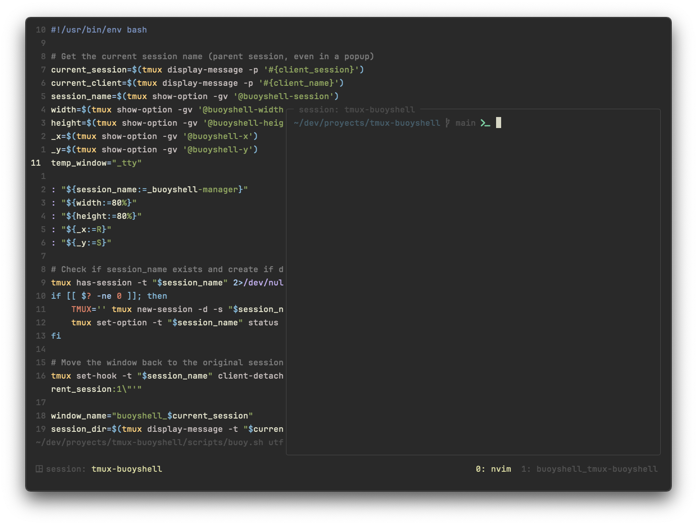

# BuoyShell

A Tmux plugin providing persistent floating shells per session with automatic management.



## Overview

BuoyShell is a minimal Tmux plugin that creates a dedicated manager session for handling independent floating shells. It's designed to be lightweight and simple.

For a more feature-rich floating window implementation, check out [tmux-floax](https://github.com/omerxx/tmux-floax).

Key features of BuoyShell:

- Independent floating shell per Tmux session with persistence
- Hidden status bar by default
- Clean session management with automatic window creation
- Simple popup toggling with a single keybinding

## Installation

### With Tmux Plugin Manager (TPM)

Add to `~/.tmux.conf`:
```tmux
set -g @plugin 'cnavajas/tmux-buoyshell'
```

Install with `prefix + I`

### Manual Installation

```bash
git clone https://github.com/cnavajas/tmux-buoyshell.git ~/.tmux/plugins/tmux-buoyshell
```

Add to `~/.tmux.conf`:
```tmux
run-shell ~/.tmux/plugins/buoyshell/buoyshell.tmux
```

## Usage

Press `prefix + f` to toggle the floating shell.

The plugin will:
1. Create a hidden manager session if it doesn't exist
2. Create a dedicated window for your current session if needed
3. Show the shell in a centered popup

When you exit the popup, your shell state persists in the manager session.

## Configuration

You can customize the plugin behavior by setting these options in your `~/.tmux.conf`:

```tmux
# Change the toggle keybinding (default: f)
set -g @buoyshell-key "f"

# Set popup dimensions (default: 80%)
set -g @buoyshell-width "80%"
set -g @buoyshell-height "80%"

# Change the manager session name (default: _buoyshell-manager)
set -g @buoyshell-session "_buoyshell-manager"
```

## Implementation Details

- Manager session name: `_buoyshell-manager`
- No status bar displayed
- Popup dimensions: 80% width, 80% height
- Windows named after their parent sessions
- Windows inherit parent session's working directory

## Upcoming Features

- Customizable popup dimensions
- Configurable keybindings
- Status bar toggle option
- Session cleanup options

## License

MIT
